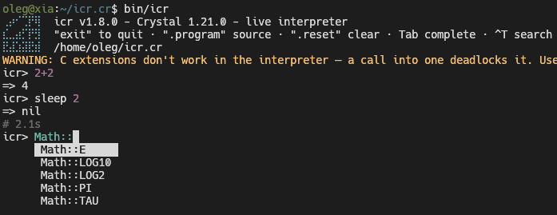

# icr — Interactive Crystal Shell

An irb-style console for Crystal:



## Two backends

- **live** — a persistent `crystal i` interpreter process driven over a
  PTY: real in-process state, ~0.1s per line (completion is detected
  from the prompt at the stream tail — see `src/icr/live.cr` — not a
  fixed silence window, so the wrapper adds only a ~30ms grace on top
  of the interpreter's own time). The PTY is openpty on Linux/macOS
  and ConPTY on Windows. Official Linux Crystal builds ship
  **without** interpreter support, so run `scripts/build-interpreter.sh`
  once to build a local compiler with `interpreter=1` into
  `~/.local/share/icr/` (nothing system-wide); official **Windows**
  builds ship **with** it — nothing to build there.

  > **Warning:** C extensions don't work in the interpreter — a call
  > into one **deadlocks the interpreter**, and the session hangs until
  > `.reset`. For code that needs C extensions use replay mode.
- **replay** — automatic fallback for stock compilers: every line
  recompiles and re-runs the whole session via `crystal run` (~1.5–3s
  per line). State "persists" because all previous lines are replayed;
  side effects (DB writes etc.) re-run on every submission.

The backend is picked automatically: `ICR_CRYSTAL` env var →
`CRYSTAL_INTERPRETER_PATH` env var →
`~/.local/share/icr/crystal/bin/crystal` → `crystal` from PATH (on
Linux this usually lacks interpreter support and icr falls through to
replay; on Windows the system `crystal` gives live mode directly).
The `--replay` flag skips this chain entirely and always uses replay —
handy when the code needs C extensions or the interpreter misbehaves.
Both env vars are read directly from Crystal code (`ENV[...]?` in
`Icr.interpreter_bin`) at startup.

## Install

```sh
git clone https://github.com/OrelSokolov/icr.cr && cd icr.cr
shards install      # no external deps today; kept for the future
sudo rake install   # → /usr/local/bin/icr
# or without sudo:
PREFIX="$HOME/.local" rake install   # → ~/.local/bin/icr
rake uninstall      # remove (same PREFIX)
```

The install task builds a release binary (completion table baked in)
and copies it as `icr` — `icr.exe` on Windows, where the default
prefix is `%USERPROFILE%\.local` (no admin rights needed). The binary
needs `crystal` in PATH for the replay fallback and for
`scripts/build-interpreter.sh` to have somewhere to live.

## Usage

```sh
bin/icr                          # or: crystal run src/cli.cr
bin/icr --replay                 # force replay mode, no interpreter
ICR_CRYSTAL=/path/to/crystal bin/icr
CRYSTAL_INTERPRETER_PATH=/path/to/crystal bin/icr
```

Commands inside the console:

| command     | action                                   |
|-------------|------------------------------------------|
| `.program`  | print the session source so far          |
| `.reset`    | drop state (live: restart the process)   |
| `.exit` / `exit` / Ctrl+D | quit                       |
| `Tab`       | autocomplete; accept the selected match  |
| `Ctrl-T`    | fuzzy search over the baked table        |

While you type, an IRB-style candidate menu opens below the line
(same flow as reline): `↑`/`↓` move the selection, `Tab` accepts it,
`Esc` dismisses the menu until the input changes, `Enter` submits the
line as-is. While the menu is open, `↑`/`↓` belong to it, not to
history navigation.

Completion follows Crystal's namespace rules: `.` completes methods
(`Math.sq` → `sqrt` — module-level defs count, instance methods on a
class name don't), `::` completes constants and nested types
(`Math::P` → `Math::PI`, `Colorize::` → its nested types). Constants
are never offered after a dot — `Math.PI` isn't Crystal. Bare words
complete to what's actually callable at the top level: global defs
(`sl` → `sleep`, `pu` → `puts`), Object methods and type names — a
bare `sqrt` completes to nothing because in Crystal it only exists as
`Math.sqrt`; Ctrl-T searches every method in the table.

An incomplete line (`def f`, open blocks…) continues with `... >`
prompts until the expression is complete. In replay mode, end a line
with `\` to continue on the next one.

The input line is syntax-highlighted with the same stdlib highlighter
the interpreter uses for its own echo (`crystal/syntax_highlighter`
— see `Crystal::ReplReader#highlight` in the Crystal sources), so
icr's prompt line and the interpreter's colors match token for token.
`NO_COLOR` and `TERM=dumb` disable it.

## Autocomplete (baked at compile time)

When the whole program (icr included) is compiled, a macro harvest
(`src/icr/completion.cr`) walks the type graph and "bakes" a TSV table
of types, methods and constants into the binary — `Icr::Completion::TABLE`.
The standalone `bin/icr` opts in itself (stdlib + icr), so Tab completes
`Str` → `String`, `String.bu` → `String.build…`, and Ctrl-T opens a
fuzzy-search overlay over every method.

Host apps that use icr as a library opt in with `require_with_autocomplete`,
which is a plain `require` plus namespace roots:

```crystal
require "icr"
require_with_autocomplete "./my_math", MyMath
```

Classes and structs anywhere in the program are harvested automatically;
modules and enums are invisible to `Object.all_subclasses`, so list them
explicitly as roots. Programs that never opt in get an empty table —
zero cost.

Known limits (see `plans/autocomplete.md` for the full analysis):

- The table is a build-time snapshot: types defined *later inside the
  session* are not completed.
- Only literal type names are completed after `.` (`MyMath.sq<Tab>`),
  not variables — the host process can't know a variable's runtime type.


## As a library

Both sessions share one interface, and `Icr.open_session` picks the
best backend automatically — a live interpreter whenever one is
available (same chain as the CLI: `ICR_CRYSTAL` →
`CRYSTAL_INTERPRETER_PATH` → `~/.local/share/icr/…` → `crystal` on
PATH), replay otherwise. Works identically when icr is installed as
a shard into another app; the env vars are read from Crystal code at
call time, so the host app can set them before opening a session.

```crystal
require "icr"
require_with_autocomplete "./my_math", MyMath

session = Icr.open_session          # live if available, replay otherwise
puts session.submit("2 + 2")        # => "=> 4"
session.close
```

To control the backend explicitly:

```crystal
session = Icr::LiveSession.new(Icr.interpreter_bin.not_nil!)
session = Icr.open_session(replay: true)   # force replay (the CLI's --replay)
```

## Platform support

|                                | Linux | macOS | Windows |
|--------------------------------|:-----:|:-----:|:-------:|
| Build + specs (CI)             | ✅    | ✅    | ✅     |
| Replay backend (`crystal run`) | ✅    | ✅    | ✅     |
| Syntax highlighting            | ✅    | ✅    | ✅     |
| Editor: history, candidate menu, Ctrl-T search | ✅ | ✅ | ✅ ¹ |
| Live interpreter backend (`crystal i` over a PTY) | ✅ | ✅ ² | ✅ ³ |

¹ The Windows editor uses the console's VT input mode
(ENABLE_VIRTUAL_TERMINAL_INPUT), so keys arrive as the same CSI/SS3
sequences the Unix editor parses — history, Tab completion and Ctrl-T
work identically.
² macOS builds the same code path (openpty via libutil) and the
interpreter script supports it, but neither is exercised in this
repo's CI — reports welcome.
³ Windows runs the live backend over ConPTY (CreatePseudoConsole)
against the system `crystal` — official Windows builds ship WITH
interpreter support, so no local build is needed there.

## Notes

- **Why a PTY wrapper instead of embedding the interpreter?** The
  interpreter *is* available as a library (`Crystal::Repl` in the
  compiler sources), but embedding it would pull the entire Crystal
  compiler and LLVM into every program that uses icr — your own
  project would then recompile the compiler (minutes, huge binary) on
  every build and be pinned to one exact Crystal version. Driving the
  already-built `crystal i` binary over a PTY keeps your project's
  builds completely untouched: icr is a plain dependency, and the
  interpreter is built once, separately (`scripts/build-interpreter.sh`).
  The PTY is also the only supported interface — `crystal i` has no
  machine protocol, and piping stdin without a TTY silently swallows
  results.
- Live backend: Linux and macOS (openpty via libutil; the interpreter
  builds from Crystal sources on both — see `scripts/build-interpreter.sh`)
  and Windows (ConPTY via CreatePseudoConsole, using the system
  `crystal` — official Windows builds ship WITH interpreter support,
  so `rake interpreter` does nothing extra there). macOS is untested
  in this repo.
- C extensions are not supported by the `crystal i` interpreter: calling
  into one deadlocks the interpreter process (a warning is printed at
  startup in live mode). Replay mode compiles with `crystal run` and is
  unaffected.
- The interpreter installs to `~/.local/share/icr/crystal` on every OS
  (the same path icr's loader checks).
- The PTY protocol quirks (paste threshold, window size, continuation
  prompts) are documented in `src/icr/live.cr`.
- Crystal >= 1.21.

## License

MIT
